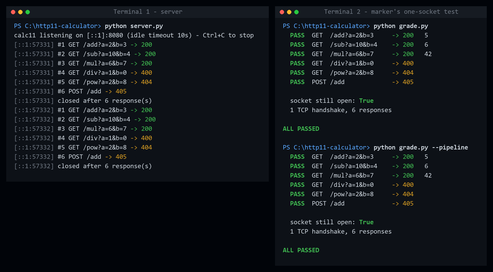
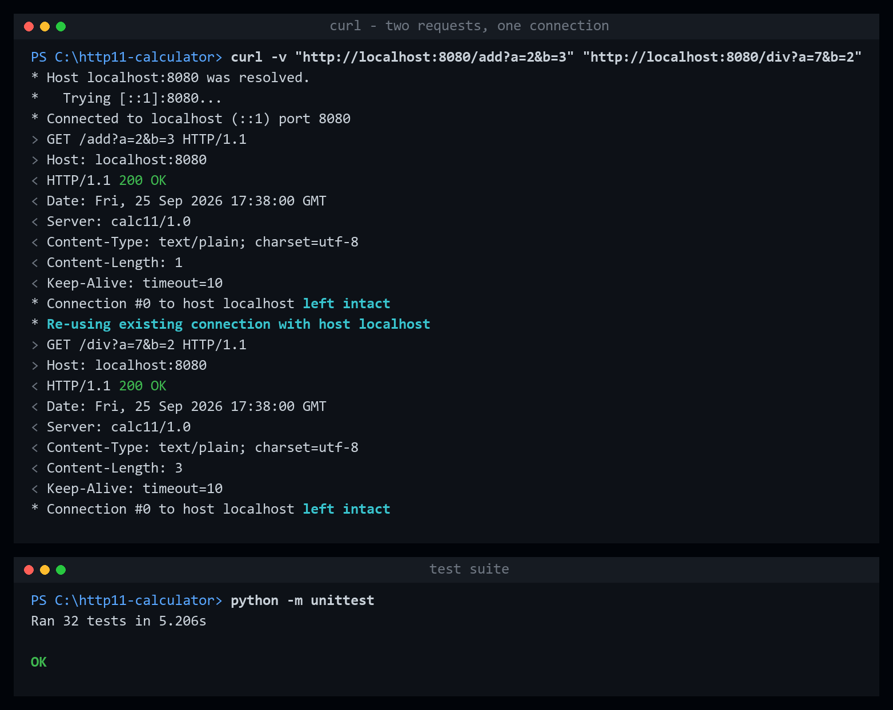

# calc11: a calculator that stays on the line

An HTTP/1.1 calculator server built directly on a TCP socket. It uses no framework and no
`http.server`, only the Python standard library. One connection can carry any number of
requests: every request gets an answer and the socket stays open.

```
s = socket.create_connection(("localhost", 8080))

  GET /add?a=2&b=3      -> 200   5
  GET /sub?a=10&b=4     -> 200   6
  GET /mul?a=6&b=7      -> 200   42
  GET /div?a=1&b=0      -> 400
  GET /pow?a=2&b=8      -> 404
  POST /add             -> 405

  socket still open: True
  1 TCP handshake, 6 responses
```

## Screenshots

**The marking scenario.** One socket carries all six requests. The first run sends them one
at a time and the second pipelines them. The server log shows one connection answering six
requests.



**curl reuses the connection,** and the test suite passes.



## Run it

You need Python 3.8 or newer. There is nothing to install.

```bash
python server.py
```

Then, in a second terminal, run the marking scenario on a single socket:

```bash
python grade.py
```

Send all six requests at once (pipelining):

```bash
python grade.py --pipeline
```

To see connection reuse with curl:

```bash
curl -v "http://localhost:8080/add?a=2&b=3" "http://localhost:8080/mul?a=6&b=7"
```

curl prints `Re-using existing connection` for the second URL.

Options: `--port 8080`, `--host localhost` (use `0.0.0.0` to expose it on the network),
`--idle-timeout 10`, `--request-timeout 30`, `--quiet`.

> If the server prints `warning: could not listen on 127.0.0.1:8080`, another program
> already owns that port (for example XAMPP's Apache). Stop that program, or pass
> `--port 9090` to both `server.py` and `grade.py`.

## Feature set

| Request                          | Response                                         |
|----------------------------------|--------------------------------------------------|
| `GET /add?a=2&b=3`               | `200` `5`                                        |
| `GET /sub?a=10&b=4`              | `200` `6`                                        |
| `GET /mul?a=6&b=7`               | `200` `42`                                       |
| `GET /div?a=9&b=3`               | `200` `3`  (`7/2` gives `3.5`)                   |
| `GET /div?a=1&b=0`               | `400` division by zero                           |
| `GET /add?a=x&b=3`               | `400` not a number (also missing or duplicate a/b, `nan`, `inf`, overflow) |
| `GET /pow?a=2&b=8`               | `404` unknown operation                          |
| `POST /add`                      | `405` with `Allow: GET, HEAD`                    |
| `GET /add` with no `Host` header | `400` (HTTP/1.1 requires `Host`)                 |

The response body is the bare result, such as `5`, with `Content-Type: text/plain`. Integer
arithmetic is exact and uses arbitrary precision. Decimals work (`2.5 * 2` gives `5`).

## The hard part: where does a request end?

With HTTP/1.0 the server hung up after each response, so a request ended at EOF. When the
connection stays open, the server has to work out the boundaries itself. `server.py` gives
each connection a byte buffer (`Connection.buf`). All parsing takes bytes from the front of
that buffer and takes only as many as the request needs:

1. **Head:** read up to the first `\r\n\r\n`. The head is limited to 8 KB (`431` if larger).
2. **Body:** read exactly what the headers announce:
   * `Content-Length: n` means read exactly `n` bytes (`read_exact`). Byte `n+1` stays in
     the buffer.
   * `Transfer-Encoding: chunked` means decode chunks until the zero-size chunk, then read
     and drop the trailer section.
   * If neither header is present, the request has no body.
3. **Leftovers** belong to the next request. They are never discarded, which is why
   pipelining works without any special code.

Test cases in `TestBodies` check this directly. One sends a `POST` whose body *looks like*
a complete HTTP request, followed by a real request. The server has to treat the first as
body and answer the second.

### When the boundary can't be trusted, close the connection

Some errors break the framing, so the server can no longer tell where the next request
starts. In those cases it answers and then closes the connection:

| Error | Response |
|---|---|
| Malformed request line or headers | `400` |
| Header folding (`obs-fold`) | `400` |
| Space before the colon in a header | `400` |
| Bad or conflicting `Content-Length` | `400` |
| Both `Content-Length` and `Transfer-Encoding` (request smuggling) | `400` |
| Unknown transfer coding | `501` |
| Body too large | `413` |
| Head too large | `431` |
| HTTP/2 request line | `505` |

Guessing in these cases would let one request's bytes be read as another request.

Errors *above* the framing layer keep the connection open: `400` for bad numbers or a
missing Host, `404`, and `405`. The request was fully read, so the next byte is known to be
the start of the next request.

## Stretch goals (all done)

* **`Connection: close` is honoured.** The server replies with `Connection: close` and hangs
  up. HTTP/1.0 clients are closed by default. They are kept open if they send
  `Connection: keep-alive`, and the server echoes that header back.
* **Idle timeout.** A connection that sits idle between requests is closed after
  **10 s** (`--idle-timeout`). The value is advertised in `Keep-Alive: timeout=10`.
  * *Why 10 s:* the server uses one thread per connection. Every idle socket holds a
    thread and a file descriptor while it waits. A client that means to keep going sends
    its next request within milliseconds, so 10 s covers a slow script or a person typing
    commands. It is also short enough that thousands of abandoned connections cannot build
    up. Apache defaults to 5 s and nginx to 75 s, and 10 s sits toward the cautious end of
    that range.
  * *A separate request timeout (30 s):* once a request starts, it has to arrive in full
    within 30 s, or the server replies `408` and closes. This stops a slowloris-style
    client from holding a thread by sending one byte every 9 seconds. The idle timeout
    alone would never fire for that client.
* **Chunked encoding.** Chunked request bodies are decoded: hex sizes, chunk extensions,
  and trailers are all handled, with every step bounded by a size limit.
* **Pipelining.** A client can send all six requests at once. The server answers them in
  order on the same socket, one at a time from the buffer (`grade.py --pipeline`).

### Other details

* **`Expect: 100-continue`** is answered with `100 Continue`.
* **`HEAD`** returns the same headers as `GET`, including `Content-Length`, but no body.
* **Leading blank lines** before a request line are ignored (RFC 9112 §2.2).
* **Graceful close:** the server calls `shutdown(SHUT_WR)` and drains input before
  `close()`. Without this, the TCP stack may send a RST that destroys the final response
  when the client has sent more data.
* **Half-closed clients:** complete requests still in the buffer are answered before the
  server closes.
* **Localhost binding:** the server listens on both `127.0.0.1` and `::1`, so
  `localhost` works however the client resolves it.
* **Nagle is disabled** (`TCP_NODELAY`), so pipelined responses are not delayed.

## Tests

```bash
python -m unittest -v
```

There are 32 end-to-end tests. Each one starts a real server on a real socket. They cover:

* the feature table
* the one-socket marking scenario
* pipelining
* 200 requests on one connection
* a request sent one byte at a time
* bodies framed by `Content-Length` and by chunking
* `Expect: 100-continue`
* `Connection: close`, HTTP/1.0, and the idle and request timeouts
* 17 malformed or smuggling-style requests
* 20 concurrent clients

## Files

| File | Purpose |
|---|---|
| `server.py` | the server: socket handling, framing, parsing, and arithmetic |
| `grade.py` | replays the marker's one-socket scenario against a running server |
| `test_server.py` | end-to-end test suite |
